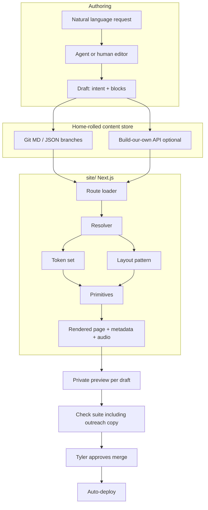
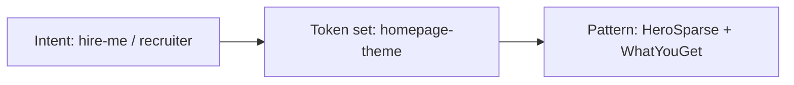
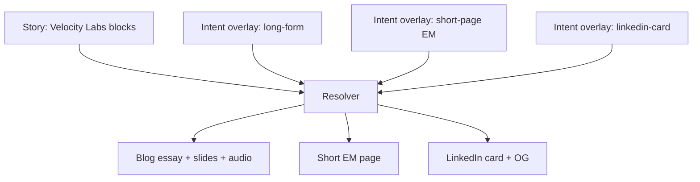

# Design components architecture: message matches the medium

## Revision 2 (2026-10-01)

| Change | Reviewer |
| --- | --- |
| Assume home-rolled CMS (option 15) as backend; continuous content flow (draft → preview → check → approve → merge → deploy; no release calendar) | Tyler decision |
| Hosting recommendation: private repo (GitHub free) + Cloudflare Pages Free ($0 added); replaces GitHub Pages; waiting on Tyler | Team hosting decision |
| Required order before first company page (private → Cloudflare → URL check → DNS window → then pages); why public history matters | Team hosting decision |
| URL parity check script + CI job (preview vs live, then post-DNS); path inventory including `/time`, blog slugs, redirects | Team hosting decision |
| Redirects must stay non-permanent; no 301/308; Cloudflare `_redirects` defaults to 302, never add 301 | Team hosting decision |
| Build budget: 500 builds/mo; preview only when draft marked ready for review; estimate well under 500 | Team hosting decision |
| Cost table: $0 added for recommended host; drop assumption that GitHub Pages stays the host | Team hosting decision |
| Who writes what: story blocks from Tyler; bots may pick blocks, set metadata, draft role-match/CTA (bot-written, Tyler approves) | Clair, Bón |
| Guardrails: outreach-copy row (no pay, location, unverified metrics, free trial); extend `check:locations` | Clair, Bón |
| Open-question answers: company pages noindex/out of sitemap/retire on close; audio optional; LinkedIn card OG vs PNG; subtle motion only on EM pages | Clair |
| Velocity Labs stays first test case; Affirm story second once written | Clair |
| `check:locations` today only scans essays; extending means new rules + new paths | Bón |
| No sitemap/robots today; noindex works per page | Bón |
| Approaches A/B add no paid service; C adds vendor bill | Wallenby |
| Retire-by date + Tinker id; weekly follow-up sweep; Tyler approves unpublish | Wallenby |
| Tracking: weekly Firebase page views per `utm_content` (free reports, no BigQuery) | Wallenby |
| Audio cost: generated ~$0.08 / 60s; free tier ~10 clips/mo; Tyler recordings free; Tyler approves each clip | Wallenby |
| Scheduled work: only rebuild per publish and weekly retire sweep | Wallenby |

**Status:** architecture only. Do not implement from this doc yet. Nothing gets built until Tyler approves LL-81 and LL-82.  
**Grounding:** current lindowlabs.dev site under `site/` (Next.js 16 App Router, static export, Tailwind 4 tokens, Framer Motion primitives).  
**Backend assumption (Tyler decision 2026-10-01):** home-rolled CMS (option 15 in `docs/cms-vendor-research.md`). Continuous integration of content, not a time-based release model.  
**Hosting recommendation (waiting on Tyler):** make `tlindow/lindowlabs` **private** on GitHub's free plan, host on **Cloudflare Pages Free** (commercial use allowed, **$0** added). This **replaces GitHub Pages**.  
**Related:** `docs/cms-vendor-research.md`, `docs/design-components-tech-spec.md`.

## Intent

Tyler's goal is to say exactly what he means and have the **page design (the medium) shift to fit the nature of the message**. The site is **not** being re-architected now. This document describes a target model that can sit on top of today's coded pages and the home-rolled content store.

Philosophy anchors (Markdown is source of intent):

- Hands-on craft and clarity (`content/typing_is_learning.md`)
- Value pillars and proof styles (`content/what_you_get_if_you_buy_me.md`)
- PR-based content as a feed (`content/README.md`)

UI today is one expression of that intent (homepage purple theme, cream paper elsewhere, case-study blog, TMAY `/time`), not the ceiling.

---

## Continuous content flow (home-rolled)

No release calendar. Each approved change ships on its own:

1. **Draft** on a branch (human or bot writes into the home-rolled store / files).
2. **Preview deployment** only when a draft is marked **ready for review** (not on every push). Tyler opens that preview on his phone. Previews count toward the Cloudflare Pages free **500 builds / mo** budget.
3. **Check suite** runs on every change, including the extended outreach copy check (see Guardrails).
4. **Tyler approves** on phone.
5. **Merge to main**, then **auto-deploy** to production immediately (continuous content flow).

Content changes are continuous integration, not batched scheduled releases. Scheduled ops stay limited to: rebuild per publish, and Wallenby's weekly retire sweep.

### Recommended hosting (waiting on Tyler)

| Item | Recommendation |
| --- | --- |
| Repo | Make `tlindow/lindowlabs` **private** on GitHub's **free** plan (Tyler owns the repo; only he can flip visibility) |
| Host | **Cloudflare Pages Free** (allows commercial use, **$0** added). Replaces GitHub Pages. |
| Preview | Cloudflare preview deployments when a draft is marked ready for review |
| Production | Every merge to `main` deploys right away |

**Other options (brief, not preferred):**

| Option | Cost | Notes |
| --- | --- | --- |
| Stay on GitHub Pages with a private repo | GitHub Pro **$4 / mo** (or $48 / yr) | Needed for private-repo Pages on a personal account |
| Keep company page content outside the repo | Host / store costs vary | Site pulls at build; public history never held those pages |

**Cost for recommended option:** **$0 added** on top of the current ~$10 / mo baseline (domain / Firebase / ops). No GitHub Pro. No paid preview host.

### Required order (nothing skipped)

Company pages must not land in git while the repo is still public. Public commit history stays readable even after a page is removed, and going private later does not help with copies already made.

1. **(a)** Tyler makes the repo private himself (he owns it).
2. **(b)** Tyler connects his Cloudflare account.
3. **(c)** Cloudflare Pages project is set up and the [URL parity check](#url-parity-check-before-dns-moves) against the Cloudflare preview address passes.
4. **(d)** DNS for `lindowlabs.dev` moves in a window **Wallenby picks from Tyler's calendar**: a weekday evening with no interview that day or the next morning, away from the Oct 7 outreach checkpoint.
5. **(e)** Only then is the first company page added.

### URL parity check before DNS moves

Spec as a **script plus a CI job** (details in `docs/design-components-tech-spec.md`). Before DNS moves, fetch every path the live site serves today from the Cloudflare preview address and compare with `https://lindowlabs.dev` (status code, final destination for redirects, page content). Any path that differs or is missing **blocks the DNS move**. Run the same check against `lindowlabs.dev` right after the switch.

**Path inventory today** (extend the script if routes are added before cutover):

| Path | Notes |
| --- | --- |
| `/` | Homepage |
| `/resume` | Resume |
| `/blog` | Blog index |
| `/blog/leading-the-affirm-dot-com-redesign` | Case study |
| `/blog/building-product-as-system-architecture` | Case study |
| `/blog/velocity-labs` | Case study |
| `/blog/building-teams-as-raising-funds` | Case study |
| `/blog/over-index-on-intuition` | Blog post |
| `/time` | TMAY entry |
| `/get-your-time-back` | Canonical TMAY page (`/time` re-exports it) |
| `/brand` | Brand |
| `/modules` | Modules |
| Every existing blog redirect | From `redirect_from` in essay front matter / `write-redirects.mjs` output. **Today that set is empty**; the check must load redirects from the same source as the build so new ones are covered automatically. |

### Redirects on Cloudflare

Existing redirects must behave the way they do now (HTML refresh / client `location.replace` via `write-redirects.mjs`, not permanent HTTP redirects). **None may become permanent (no 301 / 308).** Cloudflare's `_redirects` file defaults to **302**. Nobody should add **301** there.

### Build budget (Cloudflare Pages Free)

| Cap | 500 builds / month (previews count) |
| --- | --- |
| Preview policy | Preview build only when a draft is marked ready for review, not on every push |
| Production | Every merge to `main` deploys immediately |

**Monthly estimate for one editor (well under 500):**

| Kind | Rough count / mo | Builds |
| --- | --- | --- |
| Production deploys (merges to main) | ~12-30 content or site merges | 12-30 |
| Ready-for-review previews | ~12-30 drafts marked ready | 12-30 |
| Retries / fix-ups | ~5-10 | 5-10 |
| **Total** | | **~30-70** |

Leaves headroom under 500 even at a busy outreach month.

---

## Core concepts

### 1. Intent / message metadata

Structured fields that describe *how* a message should land, not only *what* it says.

| Field | Meaning | Example values |
| --- | --- | --- |
| `tone` | Voice posture | calm-direct, perseverant, intimate, sharp |
| `audience` | Who it is for | recruiter-em, eng-manager-peer, founder, public |
| `purpose` | Job of the page | hire-me, role-match, teach, prove, invite |
| `density` | How much to show | sparse, medium, dense |
| `emotion` | Felt temperature | steady, urgent, warm, reflective |
| `proofType` | Evidence shape | metric, story, quote, system-diagram, audio |
| `channel` | Output medium | long-form, short-page, linkedin-card, audio-led |

Today these are **implicit** in route choice and components (homepage vs `/blog/[slug]` vs `/time`). The model makes them explicit so a resolver can pick layout without new one-off React pages for every story.

### 2. Design-token layer

Already started in `site/src/app/globals.css` (`@theme inline` colors, fonts) plus homepage overrides under `.homepage-theme`.

Target: named **token sets** (surfaces, ink, accent, type ramp, spacing density, motion profile) selected by intent, not hard-coded per route forever.

Examples grounded in repo:

- Homepage lavender set (`.homepage-theme` in `globals.css`)
- Cream paper default (body / non-home routes)
- Indigo accent (`--color-indigo-dark`) used in labels and audio chrome (`PageAudioPlayer`)

### 3. Composable primitives and layout patterns

**Primitives** (exist today as components):

- Typography rhythms (`AnimatedText`, mono labels)
- Reveal motion (`ScrollReveal`, `StaggerContainer`)
- Media (`PageAudioPlayer`, slide decks in `blog/`)
- Brand marks (`brand/`)
- CTAs (`MagneticButton` pattern; homepage resume CTA)

**Layout patterns** (compositions, not pages):

- `HeroSparse` - brand + one headline + one support + one CTA (homepage header shape in `site/src/app/page.tsx`)
- `EssayLabeled` - labeled paragraph stream (`LabeledBody` + essays)
- `AudioEssay` - listen first, then short prose (`leaders/` on `/time`)
- `CaseStudySlides` - quote slides + body (`blogPosts.ts` slides + post page)
- `ProofStrip` - logos / partners (`PartnerLogos`)
- `LinkedInCard` - single shareable frame (title, one line, optional OG)

### 4. Selection / resolver layer

A pure function:

```text
(intent + content blocks + brand guardrails) → { tokenSet, layoutPattern, blockMap, motionProfile }
```

The resolver never fetches CMS data. It only maps structured inputs to presentation choices. Data loading stays in route loaders (or the home-rolled content client).

### 5. Natural language → structured content + layout

Authoring path (ties to Tinker decision A2; Tyler has final say on who writes what):

1. Human or bot states a request in plain language ("Write a short page for the Stripe EM about Velocity Labs, calm and proof-heavy, with audio").
2. **Split authorship:**
   - **Story blocks** (Decision, Result, How I led it, Belief, quotes) come from **Tyler in his own words**.
   - **Bots** may pick which blocks to use, set message metadata, and draft **role-match** and **CTA** text. Those drafts are marked bot-written and need **Tyler's approval** before publish. Bots never create or rewrite story blocks.
3. Resolver picks medium.
4. Tyler previews on phone, then publishes (merge branch → auto-deploy).

This assumes the home-rolled store (`docs/cms-vendor-research.md` option 15). The same JSON/MD shapes remain portable if storage details change later.

### 6. Guardrails (brand + a11y + outreach)

| Guardrail | Rule of thumb | Repo hook |
| --- | --- | --- |
| No em dashes in live copy | Enforced in CI | `npm run check:em-dashes` |
| Outreach copy | No pay, no location, no unverified metrics, no free trial in any block or metadata | Extend `check:locations` (not a new check). Today that script only scans `content/essays/*.md` for city names and travel phrases; extending it means **new rules plus new paths** (company pages, metadata). |
| Token contrast | WCAG AA for text pairs | Homepage comment in `globals.css` |
| Audio not required | Player optional; content readable without it | `PAGE_AUDIO_ENABLED`, optional `audioSrc` |
| Motion opt-out | Respect `prefers-reduced-motion` (to enforce in primitives) | Framer components today |
| Brand hierarchy | Brand / name signal not overpowered by a random headline | Homepage title treatment |
| SEO metadata | Every resolved page supplies title, description, OG | `generateMetadata` patterns |
| Static honesty | Resolver output must be serializable for `output: "export"` | `site/next.config.ts` |

---

## System diagram



---

## Alternative approaches (tradeoffs)

### Approach A - Convention routes + intent front matter (thin)

Keep coded routes (`/`, `/blog/[slug]`, `/time`). Add YAML/JSON intent beside content. Resolver only tweaks tokens and optional sections inside a fixed pattern per route family.

| Pros | Cons |
| --- | --- |
| Smallest change to today's App Router tree | Weak "one story, many mediums" |
| Works with home-rolled files and static export on Cloudflare Pages | Company pages still need a new route family once |
| Low cost vs ~$10 / mo baseline; **$0 added** on recommended Cloudflare Free host | Layout variety stays mostly manual |

**Fit:** nearest to current `blogPosts.ts` + essays.

### Approach B - Content objects + pattern registry (target)

One `Story` document with shared body blocks. Multiple `Rendition`s (or a resolver call per channel) select `long-form` | `short-page` | `linkedin-card`. Pattern registry in `site/src/` maps names to components.

| Pros | Cons |
| --- | --- |
| True message→medium | Needs schema discipline |
| Matches home-rolled continuous flow | Preview + OG per rendition |
| Matches Clair one-off pages once `/for/[slug]` exists | More upfront design system work |
| **$0 added** host cost on recommended Cloudflare Pages Free | |

**Fit:** best match for the stated goal without rewriting the whole site at once (migrate story by story). Preferred model under the home-rolled decision.

### Approach C - Visual builder as source of truth

Editors assemble pages in Builder/Storyblok; intent metadata is secondary.

| Pros | Cons |
| --- | --- |
| Fast landing pages | Design can drift from brand tokens |
| Less resolver logic | Harder to emit LinkedIn card + essay from one source |
| | Fights bespoke motion (e.g. `ScrollMorphAvatar`) |
| | **Adds a vendor bill** (see LL-80 totals) |

**Fit:** poor for the homepage hero system; poor fit given Tyler's home-rolled decision. Kept only as a rejected comparison.

**Recommendation posture:** this architecture doc describes **B** as the model that matches the goal, with a **home-rolled** backend. It does **not** reopen vendor selection (see research doc Decision).

---

## Worked example 1: homepage

**Today:** `site/src/app/page.tsx` composes `ScrollMorphAvatar`, `Navbar`, hero copy from `SITE_SUPPORT` (`positioning.ts`), `About`, `WhatYouGet`, `Footer`, optional `pageAudio["/"]`.

**Implicit intent today:**

- audience: recruiter / hiring manager  
- purpose: hire-me  
- density: medium  
- emotion: steady  
- proofType: logos + pillars  
- channel: marketing-home  

**Under the model:** homepage remains a **pinned pattern** (`HeroSparse` + value sections) with a frozen intent document. Resolver is optional here; do not force the scroll-morph hero through a generic builder (Approach C risk).



---

## Worked example 2: case-study blog post

**Today:** slug from `blogPosts.ts`, body from `content/essays/*.md`, optional audio, `LabeledBody`, slides.

Example: Velocity Labs (`content/essays/velocity-labs.md`, post entry in `blogPosts.ts`).

**Implicit intent:** teach + prove; audience peers/recruiters; proofType story + belief quotes; channel long-form.

**Under the model:** same `Story` feeds blog long-form rendition; slides become `proof.quote` blocks; audio is a `media.audio` block.

---

## Worked test case: one story, three mediums (from Clair)

**Source story:** Velocity Labs (Affirm, Sep 2025) - organizational intelligence, incidents, AI-driven delivery. Canonical paragraphs already labeled in `content/essays/velocity-labs.md`.

**Test cases:** Velocity Labs stays the first test case. Tyler's Affirm story becomes the **second** test case once written.

Shared **content blocks** (channel-agnostic; story blocks from Tyler):

1. Decision - implemented Velocity Labs to clear incidents and unlock revenue work  
2. Result - ~10 incidents including Intuit launch blocker; portal backend revamp in parallel  
3. How I led - objective, 1:1s, mindset shift on AI  
4. Belief - growth mindset over legacy blame  
5. Closing quote - intelligence age + trust  

Shared **default intent** (story DNA):

```text
tone: calm-direct
emotion: reflective
proofType: story
purpose: prove
```

### Medium A - Long blog post

| Intent overlay | Resolver output |
| --- | --- |
| `channel: long-form` | pattern `EssayLabeled` + `CaseStudySlides` |
| `audience: public` | token set cream paper |
| `density: dense` | all five blocks + slides + optional blog audio |

**Maps to today:** `/blog/velocity-labs` style page (`site/src/app/blog/[slug]/page.tsx`).

### Medium B - Short page for one engineering manager

| Intent overlay | Resolver output |
| --- | --- |
| `channel: short-page` | pattern `AudioEssay` or `HeroSparse` + 2 paragraphs |
| `audience: eng-manager-peer` | slightly warmer tokens optional |
| `density: sparse` | Decision + Belief only; CTA "Talk on LinkedIn" |
| `purpose: role-match` | show role-match blurb block (bot may draft; Tyler approves) |

**Maps to today:** closer to `/time` density (`leaders/`), but personalized; needs a future `/for/[slug]` shell for Clair's "pages for one company" need.

**Company page lifecycle (from Clair + Wallenby):** pages are **noindex**, out of sitemap, and **retired when the opportunity closes**. Each page gets a **retire-by date** and its **Tinker id**. Wallenby's weekly follow-up sweep flags pages whose opportunity closed or date passed; Tyler approves the unpublish. Tracking uses **weekly page views per `utm_content` id** from Firebase free reports (no BigQuery export).

**Audio on EM pages (from Clair + Wallenby):** optional on every medium. A 30-60s clip suits an EM page; the page must read fine without it. Generated 60s clip (~1,000 chars) ~ **$0.08** at ElevenLabs list rates; free tier ~**10 clips / month** (https://elevenlabs.io/pricing/api, accessed 2026-10-01). Tyler's own recordings cost nothing. Doc (and publish flow) records which, and **Tyler approves each clip**.

**Motion on EM pages (from Clair):** subtle reveals only, never the homepage morph.

### Medium C - Single LinkedIn card

| Intent overlay | Resolver output |
| --- | --- |
| `channel: linkedin-card` | pattern `LinkedInCard` |
| `density: sparse` | one Belief line + title |
| `proofType: quote` | closing quote as body |
| OG | on-site OG image for link shares; exported PNG only when Tyler posts the image directly |

**Maps to today:** OG/twitter metadata paths (`opengraph-image.tsx`, per-post `generateMetadata`); card is a rendition, not a full page scroll.



**Test assertion:** changing only `channel` / `density` / `audience` (not rewriting the five source blocks) must be enough for the resolver to emit A, B, and C. If a medium needs new facts, those facts belong in blocks, not in the layout component.

---

## How this works with the home-rolled store

| Storage | Intent + blocks live as | Publish | Preview |
| --- | --- | --- | --- |
| Home-rolled (chosen) | git MD / JSON on branches, optional thin API | Tyler approves → merge → Cloudflare Pages auto-deploy | Preview deployment when draft marked ready for review (phone) |

The **resolver and primitives stay in `site/`**. The home-rolled loader sits in front of the resolver. Continuous flow only: no release calendar. Host is Cloudflare Pages Free after the approved cutover (not GitHub Pages).

---

## Ops cadence (from Wallenby)

| Work | Cadence |
| --- | --- |
| Rebuild | Per publish (each approved merge) |
| Retire sweep | Weekly: flag expired / closed company pages by retire-by date and Tinker id; Tyler approves removal |
| Tracking review | Weekly Firebase page views by `utm_content` (free reports) |
| No other scheduled release work | Continuous content CI |

---

## Migration posture (no build now)

1. Keep homepage and resume as coded compositions.  
2. Codify intent on one essay (Velocity Labs) as a JSON fixture beside the markdown. Affirm story is the second fixture once written.  
3. Add a pattern registry and resolver behind a feature flag.  
4. Only then wire the home-rolled loader (`docs/cms-vendor-research.md` option 15).  

Spec only until Tyler approves LL-81 and LL-82.

---

## Open questions and pending approvals (Tyler decides)

Resolved for product intent (Clair; Tyler has final say; recorded above):

- Company pages: **noindex**, out of sitemap, retired when the opportunity closes.  
- Audio: optional on every medium; 30-60s suits EM pages; page must read without it.  
- LinkedIn card: on-site OG for link shares; exported PNG only when Tyler posts the image directly.  
- Motion on EM pages: subtle reveals only, never the homepage morph.

**Pending Tyler approval: hosting + privacy.** Recommendation above: private repo (GitHub free) + Cloudflare Pages Free (**$0 added**), replacing GitHub Pages. Follow the required order before any company page lands in git. Brief alternatives: GitHub Pro at $4 / mo to stay on GitHub Pages, or keep company pages outside the repo.

In every case the published page is public at its URL. Repo privacy hides source and the list of slugs. Noindex plus a random slug keeps a live page unlisted, not secret.

Details and TypeScript contracts: `docs/design-components-tech-spec.md`.
