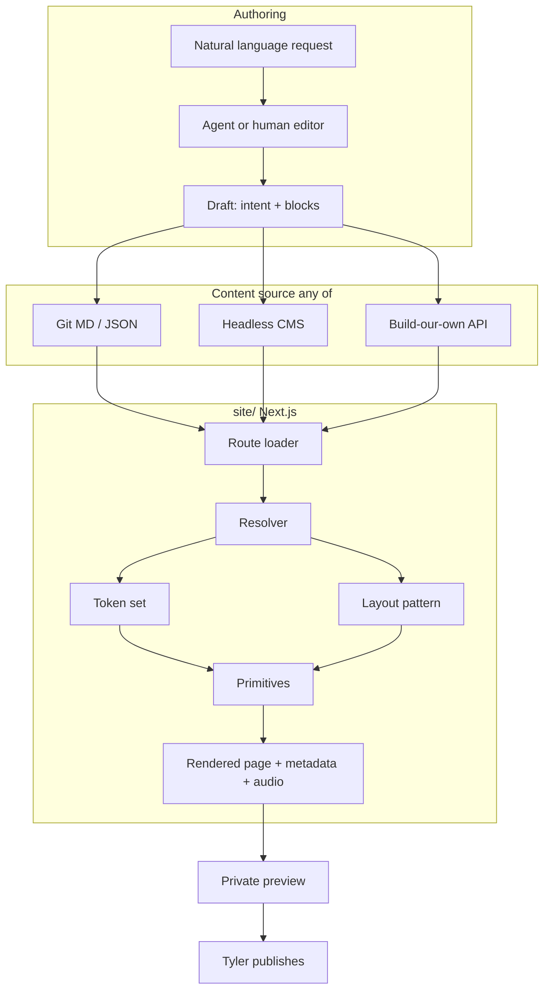
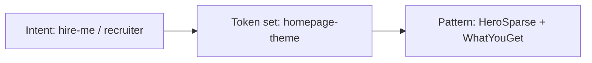
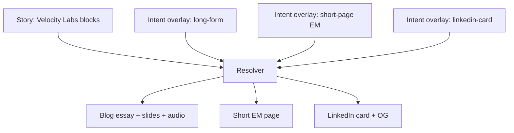

# Design components architecture: message matches the medium

**Status:** architecture only. Do not implement from this doc yet.  
**Grounding:** current lindowlabs.dev site under `site/` (Next.js 16 App Router, static export, Tailwind 4 tokens, Framer Motion primitives).  
**Related:** `docs/cms-vendor-research.md`, `docs/design-components-tech-spec.md`.

## Intent

Tyler's goal is to say exactly what he means and have the **page design (the medium) shift to fit the nature of the message**. The site is **not** being re-architected now. This document describes a target model that can sit on top of today's coded pages and any future CMS or file source.

Philosophy anchors (Markdown is source of intent):

- Hands-on craft and clarity (`content/typing_is_learning.md`)
- Value pillars and proof styles (`content/what_you_get_if_you_buy_me.md`)
- PR-based content as a feed (`content/README.md`)

UI today is one expression of that intent (homepage purple theme, cream paper elsewhere, case-study blog, TMAY `/time`), not the ceiling.

---

## Core concepts

### 1. Intent / message metadata

Structured fields that describe *how* a message should land, not only *what* it says.

| Field | Meaning | Example values |
| --- | --- | --- |
| `tone` | Voice posture | calm-direct, perseverant, intimate, sharp |
| `audience` | Who it is for | recruiter-em, eng-manager-peer, founder, public |
| `purpose` | Job of the page | hire-me, role-match, teach, prove, invite |
| `density` | How much to show | sparse, medium, dense |
| `emotion` | Felt temperature | steady, urgent, warm, reflective |
| `proofType` | Evidence shape | metric, story, quote, system-diagram, audio |
| `channel` | Output medium | long-form, short-page, linkedin-card, audio-led |

Today these are **implicit** in route choice and components (homepage vs `/blog/[slug]` vs `/time`). The model makes them explicit so a resolver can pick layout without new one-off React pages for every story.

### 2. Design-token layer

Already started in `site/src/app/globals.css` (`@theme inline` colors, fonts) plus homepage overrides under `.homepage-theme`.

Target: named **token sets** (surfaces, ink, accent, type ramp, spacing density, motion profile) selected by intent, not hard-coded per route forever.

Examples grounded in repo:

- Homepage lavender set (`.homepage-theme` in `globals.css`)
- Cream paper default (body / non-home routes)
- Indigo accent (`--color-indigo-dark`) used in labels and audio chrome (`PageAudioPlayer`)

### 3. Composable primitives and layout patterns

**Primitives** (exist today as components):

- Typography rhythms (`AnimatedText`, mono labels)
- Reveal motion (`ScrollReveal`, `StaggerContainer`)
- Media (`PageAudioPlayer`, slide decks in `blog/`)
- Brand marks (`brand/`)
- CTAs (`MagneticButton` pattern; homepage resume CTA)

**Layout patterns** (compositions, not pages):

- `HeroSparse` - brand + one headline + one support + one CTA (homepage header shape in `site/src/app/page.tsx`)
- `EssayLabeled` - labeled paragraph stream (`LabeledBody` + essays)
- `AudioEssay` - listen first, then short prose (`leaders/` on `/time`)
- `CaseStudySlides` - quote slides + body (`blogPosts.ts` slides + post page)
- `ProofStrip` - logos / partners (`PartnerLogos`)
- `LinkedInCard` - single shareable frame (title, one line, optional OG)

### 4. Selection / resolver layer

A pure function:

```text
(intent + content blocks + brand guardrails) → { tokenSet, layoutPattern, blockMap, motionProfile }
```

The resolver never fetches CMS data. It only maps structured inputs to presentation choices. Data loading stays in route loaders (or future CMS clients).

### 5. Natural language → structured content + layout

Authoring path:

1. Human or bot states a request in plain language ("Write a short page for the Stripe EM about Velocity Labs, calm and proof-heavy, with audio").
2. An authoring agent fills `MessageIntent` + `ContentBlock[]` (draft).
3. Resolver picks medium.
4. Tyler previews on phone, then publishes (CMS draft publish, or merge PR).

This is independent of vendor: the same JSON/MD can live in Sanity, git files, or a home-grown API (`docs/cms-vendor-research.md`).

### 6. Guardrails (brand + a11y)

| Guardrail | Rule of thumb | Repo hook |
| --- | --- | --- |
| No em dashes in live copy | Enforced in CI | `npm run check:em-dashes` |
| Token contrast | WCAG AA for text pairs | Homepage comment in `globals.css` |
| Audio not required | Player optional; content readable without it | `PAGE_AUDIO_ENABLED`, optional `audioSrc` |
| Motion opt-out | Respect `prefers-reduced-motion` (to enforce in primitives) | Framer components today |
| Brand hierarchy | Brand / name signal not overpowered by a random headline | Homepage title treatment |
| SEO metadata | Every resolved page supplies title, description, OG | `generateMetadata` patterns |
| Static honesty | Resolver output must be serializable for `output: "export"` | `site/next.config.ts` |

---

## System diagram



---

## Alternative approaches (tradeoffs)

### Approach A - Convention routes + intent front matter (thin)

Keep coded routes (`/`, `/blog/[slug]`, `/time`). Add YAML/JSON intent beside content. Resolver only tweaks tokens and optional sections inside a fixed pattern per route family.

| Pros | Cons |
| --- | --- |
| Smallest change to today's App Router tree | Weak "one story, many mediums" |
| Works with plain files and static export | Company pages still need a new route family once |
| Low cost vs ~$10 / mo baseline | Layout variety stays mostly manual |

**Fit:** nearest to current `blogPosts.ts` + essays.

### Approach B - Content objects + pattern registry (target)

One `Story` document with shared body blocks. Multiple `Rendition`s (or a resolver call per channel) select `long-form` | `short-page` | `linkedin-card`. Pattern registry in `site/src/` maps names to components.

| Pros | Cons |
| --- | --- |
| True message→medium | Needs schema discipline |
| CMS-agnostic | Preview + OG per rendition |
| Matches Clair one-off pages once `/for/[slug]` exists | More upfront design system work |

**Fit:** best match for the stated goal without rewriting the whole site at once (migrate story by story).

### Approach C - Visual builder as source of truth

Editors assemble pages in Builder/Storyblok; intent metadata is secondary.

| Pros | Cons |
| --- | --- |
| Fast landing pages | Design can drift from brand tokens |
| Less resolver logic | Harder to emit LinkedIn card + essay from one source |
| | Fights bespoke motion (e.g. `ScrollMorphAvatar`) |

**Fit:** poor for the homepage hero system; possible for disposable company pages only.

**Recommendation posture:** this architecture doc prefers describing **B** as the model that matches the goal; it does **not** choose a CMS (see research doc).

---

## Worked example 1: homepage

**Today:** `site/src/app/page.tsx` composes `ScrollMorphAvatar`, `Navbar`, hero copy from `SITE_SUPPORT` (`positioning.ts`), `About`, `WhatYouGet`, `Footer`, optional `pageAudio["/"]`.

**Implicit intent today:**

- audience: recruiter / hiring manager  
- purpose: hire-me  
- density: medium  
- emotion: steady  
- proofType: logos + pillars  
- channel: marketing-home  

**Under the model:** homepage remains a **pinned pattern** (`HeroSparse` + value sections) with a frozen intent document. Resolver is optional here; do not force the scroll-morph hero through a generic builder (Approach C risk).



---

## Worked example 2: case-study blog post

**Today:** slug from `blogPosts.ts`, body from `content/essays/*.md`, optional audio, `LabeledBody`, slides.

Example: Velocity Labs (`content/essays/velocity-labs.md`, post entry in `blogPosts.ts`).

**Implicit intent:** teach + prove; audience peers/recruiters; proofType story + belief quotes; channel long-form.

**Under the model:** same `Story` feeds blog long-form rendition; slides become `proof.quote` blocks; audio is a `media.audio` block.

---

## Worked test case: one story, three mediums (from Clair)

**Source story:** Velocity Labs (Affirm, Sep 2025) - organizational intelligence, incidents, AI-driven delivery. Canonical paragraphs already labeled in `content/essays/velocity-labs.md`.

Shared **content blocks** (channel-agnostic):

1. Decision - implemented Velocity Labs to clear incidents and unlock revenue work  
2. Result - ~10 incidents including Intuit launch blocker; portal backend revamp in parallel  
3. How I led - objective, 1:1s, mindset shift on AI  
4. Belief - growth mindset over legacy blame  
5. Closing quote - intelligence age + trust  

Shared **default intent** (story DNA):

```text
tone: calm-direct
emotion: reflective
proofType: story
purpose: prove
```

### Medium A - Long blog post

| Intent overlay | Resolver output |
| --- | --- |
| `channel: long-form` | pattern `EssayLabeled` + `CaseStudySlides` |
| `audience: public` | token set cream paper |
| `density: dense` | all five blocks + slides + optional blog audio |

**Maps to today:** `/blog/velocity-labs` style page (`site/src/app/blog/[slug]/page.tsx`).

### Medium B - Short page for one engineering manager

| Intent overlay | Resolver output |
| --- | --- |
| `channel: short-page` | pattern `AudioEssay` or `HeroSparse` + 2 paragraphs |
| `audience: eng-manager-peer` | slightly warmer tokens optional |
| `density: sparse` | Decision + Belief only; CTA "Talk on LinkedIn" |
| `purpose: role-match` | show role-match blurb block |

**Maps to today:** closer to `/time` density (`leaders/`), but personalized; needs a future `/for/[slug]` shell for Clair's "pages for one company" need.

### Medium C - Single LinkedIn card

| Intent overlay | Resolver output |
| --- | --- |
| `channel: linkedin-card` | pattern `LinkedInCard` |
| `density: sparse` | one Belief line + title |
| `proofType: quote` | closing quote as body |
| OG | dedicated `opengraph-image` for this rendition |

**Maps to today:** OG/twitter metadata paths (`opengraph-image.tsx`, per-post `generateMetadata`); card is a rendition, not a full page scroll.



**Test assertion:** changing only `channel` / `density` / `audience` (not rewriting the five source blocks) must be enough for the resolver to emit A, B, and C. If a medium needs new facts, those facts belong in blocks, not in the layout component.

---

## How this works with any CMS or files

| Storage | Intent + blocks live as | Publish | Preview |
| --- | --- | --- | --- |
| Plain MD/JSON | front matter + body | git merge | PR preview host |
| Git CMS (Tina/Keystatic/Decap) | same files via Admin UI | merge / editorial workflow | branch preview |
| Headless SaaS | documents + draft API | editor publish | vendor preview URL |
| Build-our-own | tables or git | your publish endpoint | signed preview links |

The **resolver and primitives stay in `site/`**. Swapping CMS should not rewrite Framer components; it should only change the loader in front of the resolver.

---

## Migration posture (no build now)

1. Keep homepage and resume as coded compositions.  
2. Codify intent on one essay (Velocity Labs) as a JSON fixture beside the markdown.  
3. Add a pattern registry and resolver behind a feature flag.  
4. Only then wire a CMS loader or stick with files (`docs/cms-vendor-research.md`).

---

## Open questions

- Should company pages be indexed publicly or `noindex` after outreach?  
- Is audio a block on every medium or only long-form / TMAY-like?  
- Does LinkedIn card rendering live on-site (OG image) or as exported PNG in `public/`?  
- How much motion is allowed on sparse EM pages without feeling like the homepage?

Details and TypeScript contracts: `docs/design-components-tech-spec.md`.
