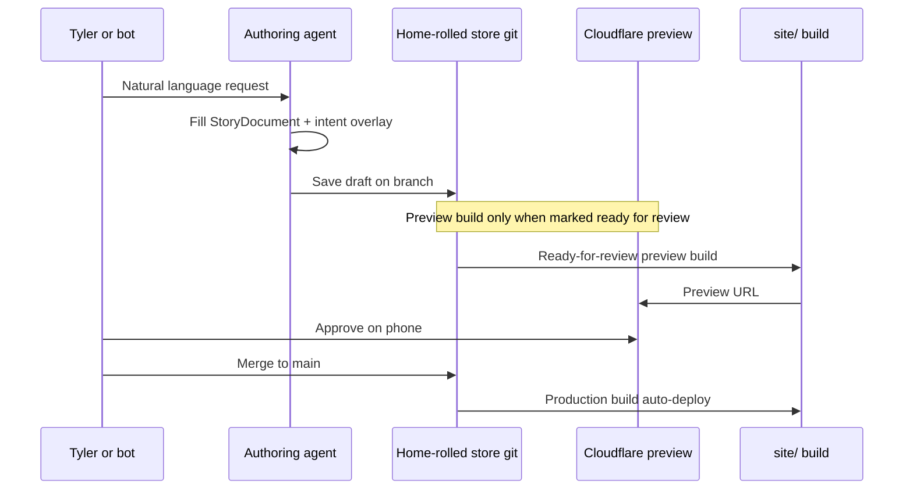

# Design components technical specification

## Revision 2 (2026-10-01)

| Change | Reviewer |
| --- | --- |
| Assume home-rolled CMS backend; continuous content flow; no release calendar | Tyler decision |
| Hosting recommendation: private repo + Cloudflare Pages Free ($0 added); replaces GitHub Pages; waiting on Tyler | Team hosting decision |
| Required order before first company page; why public history matters | Team hosting decision |
| URL parity check: path inventory, script + CI job, blocks DNS until green; re-run after switch | Team hosting decision |
| Redirects stay non-permanent; no 301/308; Cloudflare `_redirects` stays 302 | Team hosting decision |
| Build budget: preview only when ready for review; estimate ~30-70 builds/mo under 500 | Team hosting decision |
| Schema: `origin` on blocks; `seo.noindex` default true for company-specific; `tinkerPersonId` / `opportunityId` / `retireAfter` on `dedicateTo` | Clair, Wallenby |
| Bot draft rules (5)-(7): no story-block rewrite; role-match/CTA bot-drafted with approval; outreach copy check | Clair, Bón |
| Open Q1: bot drafts role-match, never auto-publish (Tinker A2). Open Q6: `/for/[slug]` + random suffix | Clair |
| Open Q7: stay near ~$10/mo; preview/host $0 on recommended path; $99+ needs its own decision | Wallenby, Team hosting |
| Random suffix is not privacy; content/slugs out of public repo or repo private (see hosting recommendation) | Bón |
| Static export: rebuild per new/retired slug; retire = remove + rebuild; old URL not-found; no permanent redirects | Bón |
| Rule 7: list new outreach rules and scanned paths | Bón |
| UTM in first company-page slice: `utm_source` linkedin\|email, `utm_content` Tinker id; Firebase auto-capture Unverified | Clair, Bón |
| Section 9: weekly Firebase views by `utm_content` for follow-up sweep (free reports) | Wallenby |
| AudioBlock: recorded vs generated; ~$0.08 / 60s generated; Tyler approves each clip | Wallenby |
| Section 6 preview: Cloudflare preview is the new infra; note build budget and deploy secrets | Wallenby, Team hosting |

**Status:** specification only. Do not implement or change site code from this document. Nothing gets built until Tyler approves LL-81 and LL-82.  
**Companion:** `docs/design-components-architecture.md`, `docs/cms-vendor-research.md`.  
**Backend assumption (Tyler decision 2026-10-01):** home-rolled CMS (option 15). Continuous integration of content, not a time-based release model.  
**Hosting recommendation (waiting on Tyler):** private `tlindow/lindowlabs` on GitHub free + **Cloudflare Pages Free** (**$0 added**). Replaces GitHub Pages.  
**Access date for dependency versions:** taken from `site/package.json` on 2026-10-02. Hosting and pricing corrections accessed **2026-10-01**.

## 1. Exact technologies and versions

### Current repo (do not bump from this doc)

| Package | Version in repo | Role |
| --- | --- | --- |
| `next` | `16.1.6` | App Router, static `output: "export"` in production (`site/next.config.ts`) |
| `react` / `react-dom` | `19.2.3` | UI |
| `typescript` | `^5` | Types |
| `tailwindcss` | `^4` | Utility CSS + `@theme inline` tokens |
| `@tailwindcss/postcss` | `^4` | PostCSS pipeline |
| `framer-motion` | `^12.35.0` | Motion primitives |
| `lucide-react` | `^0.575.0` | Icons |
| `firebase` | `^12.18.0` | Analytics + Remote Config |
| `three` / `@types/three` | `^0.185.x` | WebGL experiments (e.g. coin); out of scope for first resolver |
| Node (CI) | `20` | Deploy workflow (today GitHub Pages; target Cloudflare Pages after approval) |

### Candidate libraries (only if Tyler later chooses to build)

| Candidate | Why considered | Notes |
| --- | --- | --- |
| `zod` | Runtime validate intent + blocks from the home-rolled store | Not in repo today |
| MDX (`@next/mdx` or `next-mdx-remote`) | Richer in-repo components in essays | Static export compatible if build-time |
| `sharp` or OG helpers | Dynamic OG for renditions | Static export may need prebuild scripts |

**Do not add** permanent redirects as part of this system. Existing blog slug redirects stay in `site/scripts/write-redirects.mjs` / front matter only as already designed. None may become **301** or **308**.

---

## 2. Schemas (TypeScript types)

These types are the contract. The home-rolled store (git MD/JSON, optional thin API) must round-trip to this shape.

```ts
/** How the message should land. Overlay per rendition allowed. */
export type MessageTone =
  | "calm-direct"
  | "perseverant"
  | "intimate"
  | "sharp"
  | "warm";

export type MessageAudience =
  | "recruiter-em"
  | "eng-manager-peer"
  | "founder"
  | "public"
  | "company-specific";

export type MessagePurpose =
  | "hire-me"
  | "role-match"
  | "teach"
  | "prove"
  | "invite";

export type MessageDensity = "sparse" | "medium" | "dense";

export type MessageEmotion =
  | "steady"
  | "urgent"
  | "warm"
  | "reflective";

export type ProofType =
  | "metric"
  | "story"
  | "quote"
  | "system-diagram"
  | "audio"
  | "logo-strip";

export type MessageChannel =
  | "long-form"
  | "short-page"
  | "linkedin-card"
  | "audio-led"
  | "marketing-home";

export interface MessageIntent {
  tone: MessageTone;
  audience: MessageAudience;
  purpose: MessagePurpose;
  density: MessageDensity;
  emotion: MessageEmotion;
  proofType: ProofType;
  channel: MessageChannel;
  /** Optional company or person this rendition is for */
  dedicateTo?: {
    companyName?: string;
    personName?: string;
    roleTitle?: string;
    /** Tinker person or opportunity id for tracking and retire sweep */
    tinkerPersonId?: string;
    opportunityId?: string;
    /** ISO date; weekly sweep flags when passed or opportunity closed */
    retireAfter?: string;
  };
}

export type BlockType =
  | "heading"
  | "paragraph"
  | "labeled-paragraph"
  | "quote"
  | "cta"
  | "audio"
  | "slide"
  | "logo-strip"
  | "role-match";

export type BlockOrigin = "tyler" | "bot";

export interface ContentBlockBase {
  id: string;
  type: BlockType;
  /** Who authored the block text. Story blocks must be "tyler". */
  origin: BlockOrigin;
}

export interface LabeledParagraphBlock extends ContentBlockBase {
  type: "labeled-paragraph";
  label: "Decision" | "Result" | "How I led it" | "Belief" | string;
  text: string;
}

export interface QuoteBlock extends ContentBlockBase {
  type: "quote";
  text: string;
  attribution?: string;
}

export interface AudioBlock extends ContentBlockBase {
  type: "audio";
  src: string; // e.g. /audio/pages/blog-velocity-labs.mp3
  durationSeconds?: number;
  label?: string;
  /** Recorded by Tyler (free) vs generated (ElevenLabs ~$0.08 per 60s). Both need Tyler's approval. */
  source: "recorded" | "generated";
}

export interface SlideBlock extends ContentBlockBase {
  type: "slide";
  slideNumber: string;
  quote: string;
  subtext?: string;
  theme?: "warm" | "dark" | "indigo";
}

export interface CtaBlock extends ContentBlockBase {
  type: "cta";
  label: string;
  href: string;
}

export interface RoleMatchBlock extends ContentBlockBase {
  type: "role-match";
  companyName: string;
  roleTitle: string;
  matchSummary: string;
}

export type ContentBlock =
  | LabeledParagraphBlock
  | QuoteBlock
  | AudioBlock
  | SlideBlock
  | CtaBlock
  | RoleMatchBlock
  | (ContentBlockBase & { type: "heading"; text: string; level?: 1 | 2 | 3 })
  | (ContentBlockBase & { type: "paragraph"; text: string })
  | (ContentBlockBase & { type: "logo-strip"; variant: "partners" | "education" });

export interface StoryDocument {
  id: string;
  slug: string;
  title: string;
  summary: string;
  /** Channel-agnostic body */
  blocks: ContentBlock[];
  /** Default DNA; renditions may overlay */
  defaultIntent: MessageIntent;
  seo?: {
    title?: string;
    description?: string;
    ogImage?: string;
    /**
     * Default true when audience is company-specific.
     * Company pages are noindex and out of sitemap.
     */
    noindex?: boolean;
  };
}

export type TokenSetId =
  | "cream-paper"
  | "homepage-lavender"
  | "sparse-warm"
  | "card-share";

export type LayoutPatternId =
  | "HeroSparse"
  | "EssayLabeled"
  | "AudioEssay"
  | "CaseStudySlides"
  | "ProofStrip"
  | "LinkedInCard"
  | "ShortRoleMatch";

export type MotionProfileId = "none" | "subtle-reveal" | "homepage-morph";

export interface ResolvedPresentation {
  tokenSet: TokenSetId;
  layoutPattern: LayoutPatternId;
  motionProfile: MotionProfileId;
  /** Subset or reorder of story.blocks */
  blocks: ContentBlock[];
  seo: {
    title: string;
    description: string;
    ogImage?: string;
    noindex?: boolean;
  };
  guardrailFlags: {
    reduceMotion: boolean;
    audioOptional: boolean;
  };
}
```

**Token layer (CSS):** continue CSS variables in `site/src/app/globals.css`. Map `TokenSetId` → class name or data attribute (e.g. `.homepage-theme`, `.token-cream-paper`). Do not invent a second parallel hex system.

---

## 3. Component API contracts

### Pattern components

Each layout pattern is a server-friendly composition that accepts resolved data only (no CMS SDK imports).

```ts
export interface PatternProps {
  story: Pick<StoryDocument, "id" | "slug" | "title" | "summary">;
  intent: MessageIntent;
  blocks: ContentBlock[];
  seo: ResolvedPresentation["seo"];
}

// Example signatures (conceptual)
// function EssayLabeled(props: PatternProps): JSX.Element
// function ShortRoleMatch(props: PatternProps): JSX.Element
// function LinkedInCard(props: PatternProps): JSX.Element
```

### Primitive contracts (align with existing files)

| Primitive | Existing path | Contract notes |
| --- | --- | --- |
| `PageAudioPlayer` | `site/src/components/PageAudioPlayer.tsx` | `{ src, label, ariaLabel?, className? }` |
| `ScrollReveal` | `site/src/components/animations/ScrollReveal.tsx` | wrap sections; honor reduced motion later |
| `LabeledBody` | `site/src/components/blog/LabeledBody.tsx` | consumes labeled paragraphs from essays |
| Partner bars | `site/src/components/brand/PartnerLogos.tsx` | logo-strip block only |

**Rule:** pattern components may import primitives. Primitives must not import the resolver or home-rolled clients. Keeps `check:client-imports` happy (see `site/scripts/check-client-imports.mjs`).

---

## 4. Resolver algorithm

Pure function; no I/O.

```ts
export function resolvePresentation(input: {
  story: StoryDocument;
  intentOverlay?: Partial<MessageIntent>;
  prefersReducedMotion?: boolean;
}): ResolvedPresentation {
  const intent: MessageIntent = {
    ...input.story.defaultIntent,
    ...input.intentOverlay,
  };

  const tokenSet = pickTokenSet(intent);
  const layoutPattern = pickLayout(intent);
  const motionProfile = pickMotion(intent, input.prefersReducedMotion);
  const blocks = selectBlocks(input.story.blocks, intent);
  const seo = buildSeo(input.story, intent, blocks);

  return {
    tokenSet,
    layoutPattern,
    motionProfile,
    blocks,
    seo,
    guardrailFlags: {
      reduceMotion: Boolean(input.prefersReducedMotion) || motionProfile === "none",
      audioOptional: true,
    },
  };
}
```

### Selection tables

**Tokens**

| Condition | TokenSetId |
| --- | --- |
| `channel === "marketing-home"` | `homepage-lavender` |
| `channel === "linkedin-card"` | `card-share` |
| `channel === "short-page"` && audience peer | `sparse-warm` |
| else | `cream-paper` |

**Layout**

| Condition | LayoutPatternId |
| --- | --- |
| `channel === "linkedin-card"` | `LinkedInCard` |
| `channel === "audio-led"` | `AudioEssay` |
| `channel === "short-page"` && `purpose === "role-match"` | `ShortRoleMatch` |
| `channel === "long-form"` && has slides | `CaseStudySlides` (includes labeled essay) |
| `channel === "long-form"` | `EssayLabeled` |
| `channel === "marketing-home"` | `HeroSparse` |

**Block selection**

| Density / channel | Keep |
| --- | --- |
| `linkedin-card` | title + one `quote` or one `Belief` labeled paragraph |
| `sparse` short-page | `Decision` + `Belief` + optional `role-match` + one `cta` |
| `medium` | Decision, Result, How I led it, Belief |
| `dense` long-form | all labeled paragraphs + slides + audio if present |

**Conflicts:** if `proofType === "audio"` but no audio block, resolver omits player (never invents src). If `dedicateTo` present without `role-match` block, synthesize nothing; authoring must supply the block (bot may draft with `origin: "bot"`; Tyler approves; never auto-publish).

**SEO default:** when `audience === "company-specific"`, `seo.noindex` defaults to `true`.

---

## 5. Authoring flow



**Bot draft rules (Clair + Tinker A2):**

1. Writes never go straight to live production fields.  
2. Draft id or git branch is required.  
3. Audio files land in `public/audio/` (or home-rolled asset equivalent) before publish. Tyler approves each clip (recorded or generated).  
4. Em dashes forbidden in block text (same as `check:em-dashes`).  
5. Bots never create or rewrite **story blocks** (Decision, Result, How I led it, Belief, quotes). They may only choose which existing Tyler-written blocks to use.  
6. Role-match and CTA blocks can be bot-drafted with `origin: "bot"` and need Tyler's approval before publishing. Never auto-publish.  
7. Every block passes the **outreach copy check** (extend `check:locations`, not a new check):
   - **Rules:** no pay, no location, no unverified metrics, no free trial in any block or metadata.
   - **Paths scanned (new):** company page content/files, story JSON fixtures, intent/metadata fields, plus today's `content/essays/*.md` city/travel scan.
   - Today `check:locations` only scans essays for city names and travel phrases; extending it means these new rules and paths.

**Continuous content flow:** draft on a branch → preview when ready for review → check suite on every change → Tyler approves → merge → auto-deploy. No release calendar.

---

## 6. Preview, hosting, and render pipeline

### Production today (before cutover)

1. `npm run build` in `site/` → `next build` + `write-redirects.mjs`  
2. GitHub Actions uploads `site/out` to **GitHub Pages** (`.github/workflows/deploy.yml`: push to `main` + `workflow_dispatch`)

### Recommended production (waiting on Tyler)

| Item | Spec |
| --- | --- |
| Repo | Private on GitHub free plan (Tyler flips visibility) |
| Host | **Cloudflare Pages Free** (**$0 added**; commercial use allowed). Replaces GitHub Pages. |
| Preview | Cloudflare preview deployment when a draft is marked ready for review (not every push) |
| Production | Every merge to `main` deploys immediately |
| Build cap | 500 builds / mo; previews count |
| Secrets | Prefer Cloudflare deploy integration (no GitHub token in a vendor). If a rebuild hook is ever needed, treat the hook URL as a secret. Repo-scoped GitHub tokens for CMS-triggered rebuilds are for other vendors; home-rolled stays in-repo. |

**Other options (brief):** GitHub Pro **$4 / mo** to stay on GitHub Pages with a private repo; or keep company page content outside the repo.

### Required order (nothing skipped)

Public commit history stays readable even after a page is removed. Going private later does not help with copies already made. Therefore:

1. **(a)** Tyler makes the repo private himself.  
2. **(b)** Tyler connects his Cloudflare account.  
3. **(c)** Cloudflare Pages project is set up and the URL parity check against the Cloudflare preview address passes.  
4. **(d)** DNS for `lindowlabs.dev` moves in a window Wallenby picks from Tyler's calendar: weekday evening, no interview that day or the next morning, away from the Oct 7 outreach checkpoint.  
5. **(e)** Only then is the first company page added.

### URL parity check (script + CI job)

**Spec only until approved.** Implement later as:

- `site/scripts/check-url-parity.mjs` (name flexible)
- A CI job that runs the script against a base URL

**Inputs:**

- `--live` default `https://lindowlabs.dev`
- `--candidate` Cloudflare preview URL (pre-DNS) or `https://lindowlabs.dev` (post-DNS)

**For each path in the inventory:**

1. Fetch live and candidate.  
2. Compare **status code**.  
3. For redirects: compare **final destination** (after follow, and/or the redirect HTML target for current `write-redirects` pages).  
4. Compare **page content** (normalized HTML body or checksum of meaningful content).  

**Gate:** any path that differs or is missing **blocks the DNS move**. After DNS switches, run the same check with `--candidate https://lindowlabs.dev` (or live-vs-live smoke against expected fixtures) and treat failures as rollback signals.

**Path inventory (today):**

| Path |
| --- |
| `/` |
| `/resume` |
| `/blog` |
| `/blog/leading-the-affirm-dot-com-redesign` |
| `/blog/building-product-as-system-architecture` |
| `/blog/velocity-labs` |
| `/blog/building-teams-as-raising-funds` |
| `/blog/over-index-on-intuition` |
| `/time` |
| `/get-your-time-back` |
| `/brand` |
| `/modules` |
| Every existing blog redirect from `redirect_from` / `write-redirects.mjs` (**currently none**; load dynamically at check time) |

### Redirects

Existing redirects must behave the way they do now (`write-redirects.mjs` HTML refresh + `location.replace`). **None may become permanent (no 301 / 308).** If Cloudflare `_redirects` is used, it defaults to **302**. Nobody should add **301** there.

### Build budget estimate (one editor)

| Kind | Rough count / mo | Builds |
| --- | --- | --- |
| Production (merge to main) | ~12-30 | 12-30 |
| Ready-for-review previews | ~12-30 | 12-30 |
| Retries / fix-ups | ~5-10 | 5-10 |
| **Total** | | **~30-70** (well under 500) |

### Render steps for a story route

1. Load `StoryDocument` from the home-rolled store.  
2. Read channel from route or query (`?channel=short-page` only for preview).  
3. `resolvePresentation(...)`.  
4. Render pattern + `generateMetadata` from `seo` (honor `noindex`).  
5. If audio block present and `PAGE_AUDIO_ENABLED`, mount `PageAudioPlayer`.

**Static export:** `/for/[slug]` slugs must be known at build time. Each new or retired page means a rebuild. Retiring = remove and rebuild; old URL returns not-found. No permanent redirects.

---

## 7. Performance, accessibility, SEO rules

### Performance budget (initial)

| Metric | Budget |
| --- | --- |
| Route JS (pattern + primitives) | Prefer no visual-builder runtime on long-form essays |
| Audio | `preload="metadata"` (already on `PageAudioPlayer`) |
| Images | `images.unoptimized: true` remains under static export |
| Fonts | Existing `next/font` in `layout.tsx` (Inter, Space Mono, Silkscreen, Fraunces) |

### Accessibility

- Every pattern: one `h1`.  
- Audio control has accessible name (existing `ariaLabel`).  
- Contrast AA for token sets (homepage comment already documents pairs).  
- `prefers-reduced-motion` → `motionProfile: "none"`.  
- LinkedIn card OG is decorative for screen reader users of the HTML fallback.  
- EM / short-page motion: `subtle-reveal` only, never `homepage-morph`.

### SEO / share

- `metadataBase` remains `https://lindowlabs.dev` (`layout.tsx`).  
- Each rendition supplies title, description, OG title/description; OG image per Clair need #5.  
- Company pages: `noindex` default, out of sitemap (no sitemap/robots file on the site today; noindex works per page in static export).  
- LinkedIn card: on-site OG for link shares; exported PNG only when Tyler posts the image directly.  
- Do not invent fake metrics in metadata.

---

## 8. Testing strategy

Use existing gate: **`npm run check`** in `site/package.json`:

1. `lint`  
2. `typecheck` (`tsc --noEmit`)  
3. `check:client-imports`  
4. `check:em-dashes -- --source`  
5. `build`  
6. `check:labels`  
7. `check:em-dashes` (built HTML)  
8. `check:locations` (to be extended for outreach copy rules + company page paths)

### Additional tests when implementing (future)

| Layer | What |
| --- | --- |
| Unit | `resolvePresentation` tables (channel × density → pattern + block ids) |
| Type | Story fixtures assignable to `StoryDocument` |
| Visual regression | Homepage, one blog slug, `/time`, LinkedIn card OG snapshot |
| a11y | axe on resolved short-page and long-form |
| Three-medium fixture | Velocity Labs story must resolve A/B/C without editing blocks |
| URL parity | `check-url-parity` vs Cloudflare preview (blocks DNS) and post-switch |
| Outreach copy | Extended `check:locations` on company pages + metadata |

---

## 9. Migration path from today's pages

| Surface | Today | Step |
| --- | --- | --- |
| Homepage | `site/src/app/page.tsx` | Leave coded; optional intent fixture only |
| Blog list/detail | `blogPosts.ts` + `content/essays` + `[slug]/page.tsx` | Introduce `StoryDocument` adapter from essay labels + post meta |
| `/time` TMAY | `leaders/*` + `time-note.mp3` | Extract copy/audio into a story with `channel: audio-led` **or** keep coded until second |
| Resume | Formation-linked pages | Out of scope for message resolver |
| Audio map | `pageAudio.ts` | Migrate into `AudioBlock` per story/page (`source: recorded \| generated`) |
| Analytics | Firebase + `?variant=` | Keep; **UTM passthrough in the first company-page slice** (not later): `utm_source` = `linkedin` \| `email`, `utm_content` = Tinker person or opportunity id (never a name). Firebase may record `utm_*` on page views on its own (**Unverified** until tested). Site has no UTM helpers today. |
| Hosting | GitHub Pages | Cut over to Cloudflare Pages Free per required order; drop GitHub Pages after DNS move |

**Order:** adapter for Velocity Labs → resolver unit fixtures → one experimental route behind flag → home-rolled loader. Affirm story is the second test case once written. Company pages only after hosting required order completes.

**Tracking read path (Wallenby):** weekly Firebase page views by `utm_content` feed the follow-up / retire sweep; free reports, not paid BigQuery export.

**Migration effort:** home-rolled files/adapter **Low-Medium**; full move of blog + TMAY audio into the store **Medium**.

---

## 10. Edge cases

- Missing audio file path → skip player; do not break page.  
- Empty blocks after density filter → fall back to `summary` paragraph.  
- `dedicateTo` without publish rights → draft only.  
- Optional `retireAfter` and `tinkerPersonId` / `opportunityId` on `dedicateTo`. Weekly sweep flags expired/closed; Tyler approves removal and rebuild.  
- Static export + draft preview → preview is a Cloudflare preview deployment; production stays export.  
- Slide themes vs token set clash → slides keep local theme enum; page chrome follows token set.  
- Em dash in bot output → reject draft in authoring check.  
- Outreach copy violation → fail extended `check:locations`.  
- Retiring a company page → unpublish / delete document and rebuild; old URL not-found; do not add permanent redirects.  
- Homepage morph motion profile must not activate on short-page patterns.  
- Random URL suffix is **not** privacy: with a public repo, page source or a slug list in git exposes URLs. Follow hosting recommendation (private repo + Cloudflare) or keep content outside the repo.  
- Audio: generated ~$0.08 per 60s (~1,000 chars) at ElevenLabs list rates; free tier ~10 clips/mo (https://elevenlabs.io/pricing/api, accessed 2026-10-01). Recorded clips free. Both need Tyler's approval before publish.

---

## 11. Worked test case: Velocity Labs × three mediums (from Clair)

**Fixture id:** `story.velocity-labs`  
**Source files today:** `content/essays/velocity-labs.md`, entry in `site/src/data/blogPosts.ts`.  
**Second test case (later):** Tyler's Affirm story once written.

### Shared blocks (abbreviated)

| id | type | origin | content |
| --- | --- | --- | --- |
| `vl-decision` | labeled-paragraph Decision | tyler | Implemented Velocity Labs… |
| `vl-result` | labeled-paragraph Result | tyler | ~10 incidents including Intuit… |
| `vl-how-1` | labeled-paragraph How I led it | tyler | Developing more with less… |
| `vl-belief` | labeled-paragraph Belief | tyler | Organizational growth mindset… |
| `vl-quote` | quote | tyler | Intelligence age… extend trust… |
| `vl-audio` | audio | tyler | `/audio/pages/blog-velocity-labs.mp3`, `source: recorded` (if present) |
| `vl-slides` | slide[] | tyler | From `blogPosts` slides for this slug |

`defaultIntent`: calm-direct, public, prove, dense, reflective, story, long-form.

### A - Long blog post

```ts
intentOverlay: { channel: "long-form", density: "dense", audience: "public" }
// expect layoutPattern: "CaseStudySlides"
// expect blocks include vl-decision…vl-quote, slides, audio
// expect tokenSet: "cream-paper"
// expect seo.title includes "Velocity Labs"
```

### B - Short EM page

```ts
intentOverlay: {
  channel: "short-page",
  density: "sparse",
  audience: "eng-manager-peer",
  purpose: "role-match",
  dedicateTo: {
    companyName: "ExampleCo",
    personName: "Alex",
    roleTitle: "Engineering Manager",
    tinkerPersonId: "tinker_example",
    retireAfter: "2026-12-01"
  }
}
// role-match + cta may be origin: "bot"; Tyler must approve before publish
// expect layoutPattern: "ShortRoleMatch"
// expect blocks: vl-decision, vl-belief, role-match, cta
// expect tokenSet: "sparse-warm"
// expect seo.noindex true when audience company-specific
// URL: /for/[slug] with slug = company name + short random suffix
```

### C - LinkedIn card

```ts
intentOverlay: { channel: "linkedin-card", density: "sparse", proofType: "quote" }
// expect layoutPattern: "LinkedInCard"
// expect blocks: vl-quote only (or Belief if quote absent)
// expect tokenSet: "card-share"
// expect seo.ogImage defined for unfurl
```

**Pass criteria:** one `StoryDocument`, three overlays, three distinct `ResolvedPresentation`s; no edits to shared story-block text between A/B/C.

---

## 12. Open questions

1. **Role-match text:** bot drafts, marked `origin: "bot"`, Tyler approves; never auto-publish. Follows Tinker A2. (Resolved direction; still needs implementation when building.)  
2. Production host: **recommendation** is Cloudflare Pages Free after private-repo cutover (waiting on Tyler). Brief alternatives: GitHub Pro $4 / mo to stay on GitHub Pages, or company pages outside the repo.  
3. Should `/time` become the reference `AudioEssay` pattern, or stay a one-off?  
4. Where do slide PNGs under `site/public/slides/` live in the block model?  
5. Is `npm run check` extended with `check:intent-fixtures` when fixtures land?  
6. **URL scheme:** `/for/[slug]`, slug = company name plus short random suffix. Random suffix is not privacy; see hosting recommendation.  
7. **Cost ceiling:** stay near ~**$10 / mo**. Recommended host adds **$0**. Only expected optional add was a paid preview host ($0-20); Cloudflare Free covers previews. Any new recurring charge goes to Tyler first; a **$99+** plan needs its own decision.

---

## 13. Non-goals

- No implementation in this change set.  
- No reopening of CMS vendor selection (home-rolled chosen).  
- No site code edits required to accept this spec.  
- No permanent redirects (no 301 / 308).  
- No fabricated uptime or budget theater numbers.  
- No company pages in git until the hosting required order completes.
