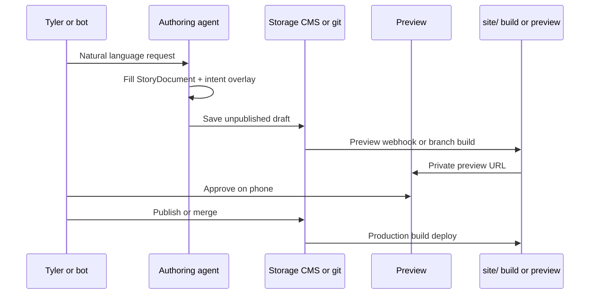

# Design components technical specification

**Status:** specification only. Do not implement or change site code from this document.  
**Companion:** `docs/design-components-architecture.md`, `docs/cms-vendor-research.md`.  
**Access date for dependency versions:** taken from `site/package.json` on 2026-10-02.

## 1. Exact technologies and versions

### Current repo (do not bump from this doc)

| Package | Version in repo | Role |
| --- | --- | --- |
| `next` | `16.1.6` | App Router, static `output: "export"` in production (`site/next.config.ts`) |
| `react` / `react-dom` | `19.2.3` | UI |
| `typescript` | `^5` | Types |
| `tailwindcss` | `^4` | Utility CSS + `@theme inline` tokens |
| `@tailwindcss/postcss` | `^4` | PostCSS pipeline |
| `framer-motion` | `^12.35.0` | Motion primitives |
| `lucide-react` | `^0.575.0` | Icons |
| `firebase` | `^12.18.0` | Analytics + Remote Config |
| `three` / `@types/three` | `^0.185.x` | WebGL experiments (e.g. coin); out of scope for first resolver |
| Node (CI) | `20` | `.github/workflows/deploy.yml` |

### Candidate libraries (only if Tyler later chooses to build)

| Candidate | Why considered | Notes |
| --- | --- | --- |
| `zod` | Runtime validate intent + blocks from CMS/files | Not in repo today |
| MDX (`@next/mdx` or `next-mdx-remote`) | Richer in-repo components in essays | Static export compatible if build-time |
| `sharp` or OG helpers | Dynamic OG for renditions | Static export may need prebuild scripts |
| CMS SDKs | Per research doc | Loader-only; keep out of primitives |

**Do not add** permanent redirects as part of this system. Existing blog slug redirects stay in `site/scripts/write-redirects.mjs` / front matter only as already designed.

---

## 2. Schemas (TypeScript types)

These types are the contract. Storage (git, Sanity, etc.) must round-trip to this shape.

```ts
/** How the message should land. Overlay per rendition allowed. */
export type MessageTone =
  | "calm-direct"
  | "perseverant"
  | "intimate"
  | "sharp"
  | "warm";

export type MessageAudience =
  | "recruiter-em"
  | "eng-manager-peer"
  | "founder"
  | "public"
  | "company-specific";

export type MessagePurpose =
  | "hire-me"
  | "role-match"
  | "teach"
  | "prove"
  | "invite";

export type MessageDensity = "sparse" | "medium" | "dense";

export type MessageEmotion =
  | "steady"
  | "urgent"
  | "warm"
  | "reflective";

export type ProofType =
  | "metric"
  | "story"
  | "quote"
  | "system-diagram"
  | "audio"
  | "logo-strip";

export type MessageChannel =
  | "long-form"
  | "short-page"
  | "linkedin-card"
  | "audio-led"
  | "marketing-home";

export interface MessageIntent {
  tone: MessageTone;
  audience: MessageAudience;
  purpose: MessagePurpose;
  density: MessageDensity;
  emotion: MessageEmotion;
  proofType: ProofType;
  channel: MessageChannel;
  /** Optional company or person this rendition is for */
  dedicateTo?: {
    companyName?: string;
    personName?: string;
    roleTitle?: string;
  };
}

export type BlockType =
  | "heading"
  | "paragraph"
  | "labeled-paragraph"
  | "quote"
  | "cta"
  | "audio"
  | "slide"
  | "logo-strip"
  | "role-match";

export interface ContentBlockBase {
  id: string;
  type: BlockType;
}

export interface LabeledParagraphBlock extends ContentBlockBase {
  type: "labeled-paragraph";
  label: "Decision" | "Result" | "How I led it" | "Belief" | string;
  text: string;
}

export interface QuoteBlock extends ContentBlockBase {
  type: "quote";
  text: string;
  attribution?: string;
}

export interface AudioBlock extends ContentBlockBase {
  type: "audio";
  src: string; // e.g. /audio/pages/blog-velocity-labs.mp3
  durationSeconds?: number;
  label?: string;
}

export interface SlideBlock extends ContentBlockBase {
  type: "slide";
  slideNumber: string;
  quote: string;
  subtext?: string;
  theme?: "warm" | "dark" | "indigo";
}

export interface CtaBlock extends ContentBlockBase {
  type: "cta";
  label: string;
  href: string;
}

export interface RoleMatchBlock extends ContentBlockBase {
  type: "role-match";
  companyName: string;
  roleTitle: string;
  matchSummary: string;
}

export type ContentBlock =
  | LabeledParagraphBlock
  | QuoteBlock
  | AudioBlock
  | SlideBlock
  | CtaBlock
  | RoleMatchBlock
  | (ContentBlockBase & { type: "heading"; text: string; level?: 1 | 2 | 3 })
  | (ContentBlockBase & { type: "paragraph"; text: string })
  | (ContentBlockBase & { type: "logo-strip"; variant: "partners" | "education" });

export interface StoryDocument {
  id: string;
  slug: string;
  title: string;
  summary: string;
  /** Channel-agnostic body */
  blocks: ContentBlock[];
  /** Default DNA; renditions may overlay */
  defaultIntent: MessageIntent;
  seo?: {
    title?: string;
    description?: string;
    ogImage?: string;
  };
}

export type TokenSetId =
  | "cream-paper"
  | "homepage-lavender"
  | "sparse-warm"
  | "card-share";

export type LayoutPatternId =
  | "HeroSparse"
  | "EssayLabeled"
  | "AudioEssay"
  | "CaseStudySlides"
  | "ProofStrip"
  | "LinkedInCard"
  | "ShortRoleMatch";

export type MotionProfileId = "none" | "subtle-reveal" | "homepage-morph";

export interface ResolvedPresentation {
  tokenSet: TokenSetId;
  layoutPattern: LayoutPatternId;
  motionProfile: MotionProfileId;
  /** Subset or reorder of story.blocks */
  blocks: ContentBlock[];
  seo: {
    title: string;
    description: string;
    ogImage?: string;
  };
  guardrailFlags: {
    reduceMotion: boolean;
    audioOptional: boolean;
  };
}
```

**Token layer (CSS):** continue CSS variables in `site/src/app/globals.css`. Map `TokenSetId` → class name or data attribute (e.g. `.homepage-theme`, `.token-cream-paper`). Do not invent a second parallel hex system.

---

## 3. Component API contracts

### Pattern components

Each layout pattern is a server-friendly composition that accepts resolved data only (no CMS SDK imports).

```ts
export interface PatternProps {
  story: Pick<StoryDocument, "id" | "slug" | "title" | "summary">;
  intent: MessageIntent;
  blocks: ContentBlock[];
  seo: ResolvedPresentation["seo"];
}

// Example signatures (conceptual)
// function EssayLabeled(props: PatternProps): JSX.Element
// function ShortRoleMatch(props: PatternProps): JSX.Element
// function LinkedInCard(props: PatternProps): JSX.Element
```

### Primitive contracts (align with existing files)

| Primitive | Existing path | Contract notes |
| --- | --- | --- |
| `PageAudioPlayer` | `site/src/components/PageAudioPlayer.tsx` | `{ src, label, ariaLabel?, className? }` |
| `ScrollReveal` | `site/src/components/animations/ScrollReveal.tsx` | wrap sections; honor reduced motion later |
| `LabeledBody` | `site/src/components/blog/LabeledBody.tsx` | consumes labeled paragraphs from essays |
| Partner bars | `site/src/components/brand/PartnerLogos.tsx` | logo-strip block only |

**Rule:** pattern components may import primitives. Primitives must not import the resolver or CMS clients. Keeps `check:client-imports` happy (see `site/scripts/check-client-imports.mjs`).

---

## 4. Resolver algorithm

Pure function; no I/O.

```ts
export function resolvePresentation(input: {
  story: StoryDocument;
  intentOverlay?: Partial<MessageIntent>;
  prefersReducedMotion?: boolean;
}): ResolvedPresentation {
  const intent: MessageIntent = {
    ...input.story.defaultIntent,
    ...input.intentOverlay,
  };

  const tokenSet = pickTokenSet(intent);
  const layoutPattern = pickLayout(intent);
  const motionProfile = pickMotion(intent, input.prefersReducedMotion);
  const blocks = selectBlocks(input.story.blocks, intent);
  const seo = buildSeo(input.story, intent, blocks);

  return {
    tokenSet,
    layoutPattern,
    motionProfile,
    blocks,
    seo,
    guardrailFlags: {
      reduceMotion: Boolean(input.prefersReducedMotion) || motionProfile === "none",
      audioOptional: true,
    },
  };
}
```

### Selection tables

**Tokens**

| Condition | TokenSetId |
| --- | --- |
| `channel === "marketing-home"` | `homepage-lavender` |
| `channel === "linkedin-card"` | `card-share` |
| `channel === "short-page"` && audience peer | `sparse-warm` |
| else | `cream-paper` |

**Layout**

| Condition | LayoutPatternId |
| --- | --- |
| `channel === "linkedin-card"` | `LinkedInCard` |
| `channel === "audio-led"` | `AudioEssay` |
| `channel === "short-page"` && `purpose === "role-match"` | `ShortRoleMatch` |
| `channel === "long-form"` && has slides | `CaseStudySlides` (includes labeled essay) |
| `channel === "long-form"` | `EssayLabeled` |
| `channel === "marketing-home"` | `HeroSparse` |

**Block selection**

| Density / channel | Keep |
| --- | --- |
| `linkedin-card` | title + one `quote` or one `Belief` labeled paragraph |
| `sparse` short-page | `Decision` + `Belief` + optional `role-match` + one `cta` |
| `medium` | Decision, Result, How I led it, Belief |
| `dense` long-form | all labeled paragraphs + slides + audio if present |

**Conflicts:** if `proofType === "audio"` but no audio block, resolver omits player (never invents src). If `dedicateTo` present without `role-match` block, synthesize nothing; authoring must supply the block (**open question** whether to auto-generate).

---

## 5. Authoring flow



**Bot draft rules (Clair):**

1. Writes never go straight to live production fields.  
2. Draft id or git branch is required.  
3. Audio files land in `public/audio/` (or CMS asset equivalent) before publish.  
4. Em dashes forbidden in block text (same as `check:em-dashes`).

---

## 6. Preview and render pipeline

### Production today

1. `npm run build` in `site/` → `next build` + `write-redirects.mjs`  
2. GitHub Actions uploads `site/out` to Pages (`.github/workflows/deploy.yml`)

### Target preview (spec only)

| Mode | Mechanism |
| --- | --- |
| Git draft | Branch build to a preview host (not main Pages) |
| SaaS draft | Vendor preview URL hitting a preview Next deployment that reads draft API |
| Static constraint | Preview app may use non-export Next for draft fetching; production can stay export if publish materializes JSON into the repo |

**Render steps for a story route:**

1. Load `StoryDocument` (file or CMS).  
2. Read channel from route or query (`?channel=short-page` only for preview).  
3. `resolvePresentation(...)`.  
4. Render pattern + `generateMetadata` from `seo`.  
5. If audio block present and `PAGE_AUDIO_ENABLED`, mount `PageAudioPlayer`.

---

## 7. Performance, accessibility, SEO rules

### Performance budget (initial)

| Metric | Budget |
| --- | --- |
| Route JS (pattern + primitives) | Prefer no Builder runtime on long-form essays |
| Audio | `preload="metadata"` (already on `PageAudioPlayer`) |
| Images | `images.unoptimized: true` remains under static export |
| Fonts | Existing `next/font` in `layout.tsx` (Inter, Space Mono, Silkscreen, Fraunces) |

### Accessibility

- Every pattern: one `h1`.  
- Audio control has accessible name (existing `ariaLabel`).  
- Contrast AA for token sets (homepage comment already documents pairs).  
- `prefers-reduced-motion` → `motionProfile: "none"`.  
- LinkedIn card OG is decorative for screen reader users of the HTML fallback.

### SEO / share

- `metadataBase` remains `https://lindowlabs.dev` (`layout.tsx`).  
- Each rendition supplies title, description, OG title/description; OG image per Clair need #5.  
- Short company pages: decide indexability later (**open question**).  
- Do not invent fake metrics in metadata.

---

## 8. Testing strategy

Use existing gate: **`npm run check`** in `site/package.json`:

1. `lint`  
2. `typecheck` (`tsc --noEmit`)  
3. `check:client-imports`  
4. `check:em-dashes -- --source`  
5. `build`  
6. `check:labels`  
7. `check:em-dashes` (built HTML)  
8. `check:locations`

### Additional tests when implementing (future)

| Layer | What |
| --- | --- |
| Unit | `resolvePresentation` tables (channel × density → pattern + block ids) |
| Type | Story fixtures assignable to `StoryDocument` |
| Visual regression | Homepage, one blog slug, `/time`, LinkedIn card OG snapshot |
| a11y | axe on resolved short-page and long-form |
| Three-medium fixture | Velocity Labs story must resolve A/B/C without editing blocks |

---

## 9. Migration path from today's pages

| Surface | Today | Step |
| --- | --- | --- |
| Homepage | `site/src/app/page.tsx` | Leave coded; optional intent fixture only |
| Blog list/detail | `blogPosts.ts` + `content/essays` + `[slug]/page.tsx` | Introduce `StoryDocument` adapter from essay labels + post meta |
| `/time` TMAY | `leaders/*` + `time-note.mp3` | Extract copy/audio into a story with `channel: audio-led` **or** keep coded until second |
| Resume | Formation-linked pages | Out of scope for message resolver |
| Audio map | `pageAudio.ts` | Migrate into `AudioBlock` per story/page |
| Analytics | Firebase + `?variant=` | Keep; add UTM passthrough helpers later |

**Order:** adapter for Velocity Labs → resolver unit fixtures → one experimental route behind flag → only then CMS loader.

**Migration effort** aligns with research doc: files/adapter **Low-Medium**; full CMS move of blog + TMAY audio **Medium**.

---

## 10. Edge cases

- Missing audio file path → skip player; do not break page.  
- Empty blocks after density filter → fall back to `summary` paragraph.  
- `dedicateTo` without publish rights → draft only.  
- Static export + draft preview → cannot call draft APIs from `site/out`; preview must be a different deployment mode.  
- Slide themes vs token set clash → slides keep local theme enum; page chrome follows token set.  
- Em dash in bot output → reject draft in authoring check.  
- Retiring a company page → unpublish / delete document; do not add permanent redirects by default.  
- Homepage morph motion profile must not activate on short-page patterns.

---

## 11. Worked test case: Velocity Labs × three mediums (from Clair)

**Fixture id:** `story.velocity-labs`  
**Source files today:** `content/essays/velocity-labs.md`, entry in `site/src/data/blogPosts.ts`.

### Shared blocks (abbreviated)

| id | type | content |
| --- | --- | --- |
| `vl-decision` | labeled-paragraph Decision | Implemented Velocity Labs… |
| `vl-result` | labeled-paragraph Result | ~10 incidents including Intuit… |
| `vl-how-1` | labeled-paragraph How I led it | Developing more with less… |
| `vl-belief` | labeled-paragraph Belief | Organizational growth mindset… |
| `vl-quote` | quote | Intelligence age… extend trust… |
| `vl-audio` | audio | `/audio/pages/blog-velocity-labs.mp3` (if present in post meta) |
| `vl-slides` | slide[] | From `blogPosts` slides for this slug |

`defaultIntent`: calm-direct, public, prove, dense, reflective, story, long-form.

### A - Long blog post

```ts
intentOverlay: { channel: "long-form", density: "dense", audience: "public" }
// expect layoutPattern: "CaseStudySlides"
// expect blocks include vl-decision…vl-quote, slides, audio
// expect tokenSet: "cream-paper"
// expect seo.title includes "Velocity Labs"
```

### B - Short EM page

```ts
intentOverlay: {
  channel: "short-page",
  density: "sparse",
  audience: "eng-manager-peer",
  purpose: "role-match",
  dedicateTo: { companyName: "ExampleCo", personName: "Alex", roleTitle: "Engineering Manager" }
}
// requires role-match + cta blocks in fixture for full page
// expect layoutPattern: "ShortRoleMatch"
// expect blocks: vl-decision, vl-belief, role-match, cta
// expect tokenSet: "sparse-warm"
```

### C - LinkedIn card

```ts
intentOverlay: { channel: "linkedin-card", density: "sparse", proofType: "quote" }
// expect layoutPattern: "LinkedInCard"
// expect blocks: vl-quote only (or Belief if quote absent)
// expect tokenSet: "card-share"
// expect seo.ogImage defined for unfurl
```

**Pass criteria:** one `StoryDocument`, three overlays, three distinct `ResolvedPresentation`s; no edits to shared block text between A/B/C.

---

## 12. Open questions

1. Auto-synthesize `role-match` text from `dedicateTo` + story summary, or require authors/bots to write it?  
2. Production host: stay on GitHub Pages static export, or move preview/prod to a Node host for draft APIs?  
3. Should `/time` become the reference `AudioEssay` pattern, or stay a one-off?  
4. Where do slide PNGs under `site/public/slides/` live in the block model?  
5. Is `npm run check` extended with `check:intent-fixtures` when fixtures land?  
6. Company page URL scheme: `/for/[slug]` vs query on a generic template?  
7. Wallenby cost ceiling: keep total stack near **$10 / mo**, or allow up to just under **$99 / mo** if a CMS unlocks Clair needs without a $99+ plan flag?

---

## 13. Non-goals

- No implementation in this change set.  
- No CMS vendor selection.  
- No site code edits required to accept this spec.  
- No permanent redirects.  
- No fabricated uptime or budget theater numbers.
